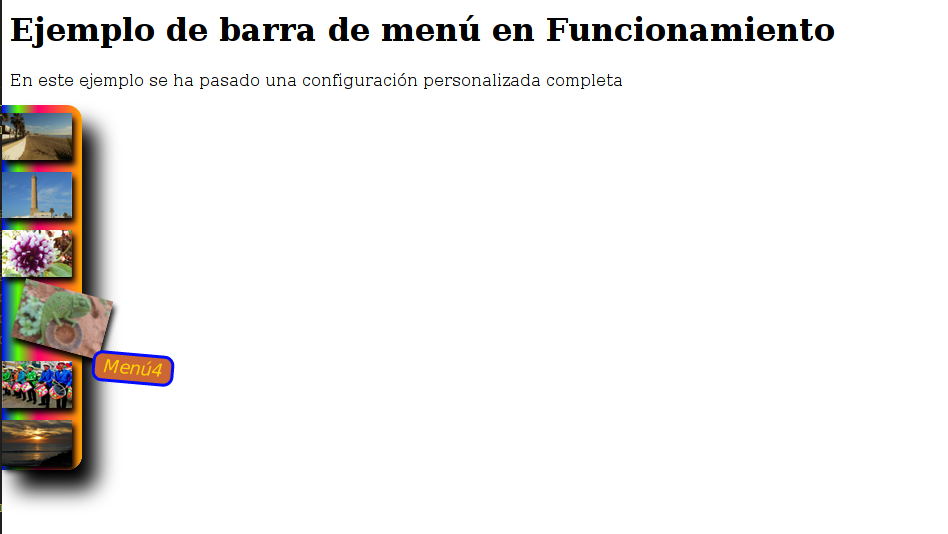

# jquery.leftbar (Versión en pruebas)
Este Plugin JQuery genera en el lateral izquierdo de la pantalla una barra de menú con los nombres y las imágenes que se les pasan.
En estos momentos está recién creado y termino de mejorar su código.


## Objetivos en el desarrollo
- [x] Crear una barra de menú
- [x] Posicionarlo en lateral izquierdo
- [x] Estilos para el menú internos en el plugin
- [x] Imagen con previsualización
- [x] Animar la imagen al pasar el ratón por encima
- [x] Mostrar el título del apartado al pasar el ratón por su imagen
- [x] Llevar a una localización cuando se hace click
- [x] Menú ligeramente enterrado hacia la izquierda, saldrá del todo al pasar ratón por encima de la propia barra o cualquiera de sus elementos

## Descripción
Es un menú configurable y adaptable.

Cuando lo invocamos le podemos decir los colores y tamaños que debe utilizar, además como segundo parámetro le pasaremos una matriz indicando cada elemento del menú.

El menú quedará un poco oculto fuera de página, con algo de transparencia hasta que pasamos el ratón por encima dándole movimiento al elemento bajo este y mostrando su título.

## Parámetros
La invocación del plugin tendrá siempre 2 parámetros:
* Opciones de configuración, un objeto (puede ser vacío) o alguno de estos:
    * back1             → Degradado → 0%
    * back2             → Degradado → 20%
    * back3             → Degradado → 45%
    * back4             → Degradado → 100%
    * letras_color      → Color de letras título
    * letras_background → Color de fondo letras
    * letras_borde      → Color del borde para bloque letras
    * letras_ancho      → El ancho del bloque para letras
    * letras_alto       → El ancho del bloque para letras
* Un array que contendrá a su vez otro array por cada elemento con los datos:
    * [0] → Nombre del menú
    * [1] → Imagen de miniatura 120x80px
    * [2] → Enlace hacia donde llevará

## Visualización con personalizaciones
Los colores con los que se visualiza el plugin pueden ser modificados a tu gusto, estos son unos ejemplos de configuración rápida introduciendo varios colores al azar




## Invocación Básica sin Confiruación
```javascript
    $.leftbar({}, [
        ['Menú1','./Demos/images/1.jpg','#'],
        ['Menú2','./Demos/images/2.jpg','#'],
        ['Menú3','./Demos/images/3.jpg','#'],
        ['Menú4','./Demos/images/4.jpg','#'],
        ['Menú5','./Demos/images/5.jpg','#'],
        ['Menú6','./Demos/images/6.jpg','http://www.fryntiz.es'],
    ]);
```

## Invocación con Confiruación
```javascript
$.leftbar({
    back1: 'rgba(0, 11, 255,1)',  // Degradado → 0%
    back2: 'rgba(91, 255, 0,1)',  // Degradado → 20%
    back3: 'rgba(255, 0, 109,1)', // Degradado → 45%
    back4: 'rgba(255, 164, 0,1)', // Degradado → 100%
    letras_color: '#FFD500',      // Color de letras título
    letras_background: '#cc6633', // Color de fondo letras
    letras_borde: '#000BFF',      // Color del borde para de letras
},
[
    ['Menú1','./images/1.jpg','#'],
    ['Menú2','./images/2.jpg','#'],
    ['Menú3','./images/3.jpg','#'],
    ['Menú4','./images/4.jpg','#'],
    ['Menú5','./images/5.jpg','#'],
    ['Menú6','./images/6.jpg','http://www.fryntiz.es'],
]);
```
## Tamaño de las imágenes
El tamaño de las imágenes para el menú es de 120x80px

## Longitud máxima de título
El menú está preparado para recibir una sola palabra, si la longitud de esta es
demasiado larga podría no verse adecudadamente.

En el caso de introducir varias palabras se verán fuera de lugar. Esto es así porque este menú está pensado para un acceso rápido a un enlace y además incluye una imagen que deberá ser descriptiba, por lo que la palabra no debería ser necesario que fuese larga o compuesta en principio.

## Modo de uso
Importa primero la librería jQuery y después este plugin, hazlo en ese orden antes de invocarlo (en el head).

Ejemplo:
```html
    <script type="text/javascript" src="./jquery-3.3.1"></script>
    <script type="text/javascript" src="./jquery.leftbar.js"></script>
```

Ahora puedes llamar al plugin pasándole la configuración que más te guste y un array por cada elemento con el menú del elemento, la ruta hacia la imagen y por último su enlace:
```javascript
    [
        ['Menú1','./images/1.jpg','#'],
        ['Menú2','./images/2.jpg','#'],
    ]
```
